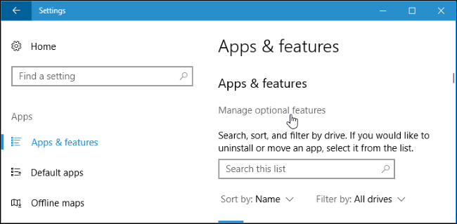
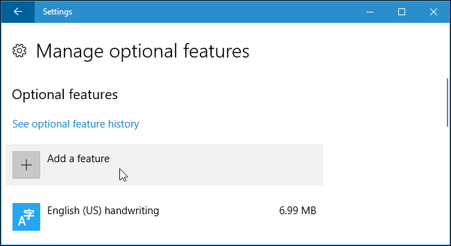

# Ruby for ArchivesSpace

## Princeton University Library Infrastructure

### Download Git Bash

Please download the latest release of `git` from [the Git website](https://git-scm.com/download/win)

### Creating SSH Keys for the User Account

Should one not have an SSH public key available, please following the instructions outlined in [the GitHub documentation](https://docs.github.com/en/authentication/connecting-to-github-with-ssh/generating-a-new-ssh-key-and-adding-it-to-the-ssh-agent)

Then please notify one of the instructors, and they will add the public key to the server account for your access.

### Accessing the Server (`ruby-office1.princeton.edu`)

#### Using Git Bash

Using the newly-installed `git`, please enter the following:

```bash
$ ssh pulsys@ruby-office1.princeton.edu
```

Should any authentication issues be encountered, please ensure that the public SSH key just generated lies within the directory `C:\Users\$USER\.ssh\id_rsa.pub`.

#### Using SSH on the PowerShell

One needs to first enable this by accessing `Settings > Apps`, and then clicking `Manage optional features`:



Please then select `Add a feature`:



Then please install `OpenSSH Client (Beta)`:


Then, please ensure that the `New-PSSession` command supports the SSH:

```powsh
> (Get-Command New-PSSession).ParameterSets.Name
```

One should see the following within the values:

```powsh
[...]
SSHHost
SSHHostHashParam
[...]
```

Then, one should please authenticate using the following:

```powsh
> $session = New-PSSession -HostName ruby-office1.princeton.edu -UserName pulsys -SSHTransport
> Enter-PSSession $session
```

### Initializing the Environment

```bash
$ cd ruby-for-archivesspace/
$ bundle install
```

